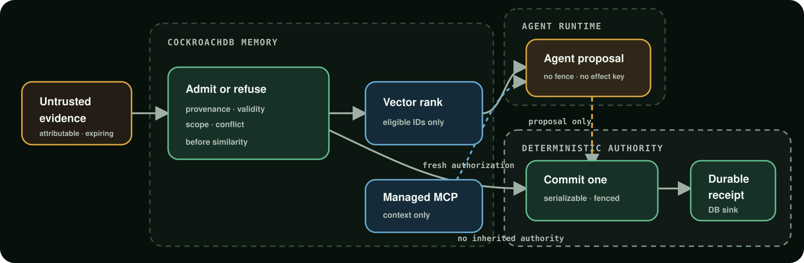

# Tideproof

**Public clean-room source. Not yet a contest submission or live AWS claim.**

Tideproof is an admissibility-memory demonstration for high-stakes agents.
Its “Highwater Drill” is a synthetic multi-agency response exercise: shared
memory preserves attributable evidence, filters what is no longer admissible,
exposes conflicts, gives exactly one local contender a scarce resource, lets a
successor reconstruct prior context, returns the original decision for an
exact duplicate, and rejects reuse with changed authority inputs.

The thesis is deliberately narrower than “AI remembers better”:

> Most memory systems optimize what an agent should remember. Tideproof governs
> what an agent is still allowed to believe and act upon.



The diagram is synthetic and claim-bounded. Its accessible text counterpart
and the fuller Gate One and Gate Two topology are in
[`docs/ARCHITECTURE.md`](docs/ARCHITECTURE.md).

## What exists now

This repository contains a deterministic local vertical slice, an accepted
CockroachDB Cloud Gate One proof, and a locally tested AWS Gate Two candidate:

- provenance, validity-window, and scope checks before vector ranking;
- unresolved-conflict detection and fail-closed authorization;
- a CockroachDB-backed candidate that derives a short-lived vector snapshot
  from the same signed-evidence, validity, revocation, scope, and conflict
  policy used inside authorization; a fresh live integrated plan/exclusion
  receipt remains pending;
- serializable one-winner resource reservation with durable denial receipts,
  semantic replay protection, monotonic fencing tokens, and a transactional
  outbox;
- a protected synthetic effect boundary that rejects stale, future, expired,
  cross-scope, and changed-payload requests;
- CockroachDB Distributed Vector Indexing with historical named-index plan
  evidence and fail-closed dimension validation; that plan proves DVI
  mechanics separately from the new admissible-snapshot integration;
- an isolated CockroachDB recovery cluster and deterministic Managed MCP
  fixed-query broker with signed context-only bundles;
- separate pre-read and terminal recovery-audit events on the primary cluster;
- 100 live 50-contender races and 100 ambiguity runs at each transaction
  boundary, with no invariant violation;
- a generated AWS CloudFormation candidate with private versioned artifacts,
  a signed-out content-only judge surface, IAM-separated Lambda roles, one bounded
  Amazon Nova Micro proposal path, P-256 KMS receipt signing with independently
  pinned public-key evidence, exact Lambda code hashes, a dedicated exact-route
  caller, private API access logs, an isolated two-concurrency CockroachDB
  authority candidate that derives capability fields outside the model and
  calls only least-privilege `SECURITY DEFINER` surfaces, then requires a
  separate read-only durable-state observation of both receipts, the winner's
  outbox and fence, and zero protected effects, plus opt-in temporary
  same-role capability probes;
- an exact-head signed-out demo verifier that compares every static and
  dynamic public response with the clean checkout, binds the health receipt to
  the built Demo artifact, checks strict browser headers, and probes route and
  advisory denials without treating reachability as advisory-path proof;
- a keyboard-operable three-act local browser demonstration with persistent
  proof-state labels, exact evidence details, receipt links, safe reset, and
  deterministic unit tests.

It does **not** yet contain or claim:

- a deployed public AWS judge URL;
- live AWS deployment, Bedrock inference, KMS signatures, or IAM denial
  evidence;
- a live CockroachDB-to-AWS handoff or overlapping Lambda authority race;
- exactly-once external effects, regional survival, or disaster readiness;
- production security, availability, or suitability for real emergencies.

Those are explicit build gates, not implied capabilities.

## Run locally

Requires Node.js 22 or newer. Local tests and the browser demo need no cloud
credentials. Live Gate One scripts use the `pg` dependency and explicit
project credentials supplied through the environment; secrets must remain in
a secret store and never enter the repository.

```sh
npm run proof:verify
npm run claims:verify
npm run governance:verify
npm run rights:verify
npm run accessibility:verify
npm run accessibility:browser
npm run dependencies:verify
npm run licenses:verify
npm test
npm run generate:gate2
npm run demo
npm run dev
```

Then open `http://127.0.0.1:4173`. The scenario and all identities are
synthetic.

## Contest target

The intended entry is for CockroachDB × AWS “Build with Agentic Memory.”
The implementation uses or is planned to use:

1. CockroachDB Distributed Vector Indexing for relevance ranking after
   admissibility filters;
2. CockroachDB Managed MCP through a deterministic context-only recovery
   broker;
3. CockroachDB serializable transactions, immutable-shaped receipts, fencing,
   and transactional outbox;
4. AWS Lambda/API Gateway for a capability-free signed-out judge surface plus
   separated IAM-authenticated proposal roles, KMS, and Amazon Bedrock; the
   local candidate is not a live-cloud claim.

The machine-checked [`PROOF_MANIFEST.json`](PROOF_MANIFEST.json) maps every
current claims-ledger row to exact evidence bytes and leaves incomplete live
gates explicit. Run `npm run proof:verify` to reject changed evidence, missing
claim coverage, unsafe paths, or a stale hash.

The fail-closed [`docs/RELEASE_CLAIMS.md`](docs/RELEASE_CLAIMS.md) control
hash-binds the current README, browser, local and AWS-hosted scenario copy,
technical boundaries, contest matrix, video script, and Devpost draft. Run
`npm run claims:verify` to reject surface drift, missing synthetic or
local-versus-live boundaries, premature submission approvals, removed stop
tokens, or unreviewed public URLs.
Its `CURRENT_PUBLIC_CLAIMS_PASS` result is
not proof that every statement is true or permission to deploy, publish, or
submit; accepted live receipts and an exact-release private review remain
mandatory.

The sanitized [`docs/RELEASE_GOVERNANCE.md`](docs/RELEASE_GOVERNANCE.md)
control binds a read-only GitHub settings observation to the reviewed public
repository, security policy, and required CI workflow. Run
`npm run governance:verify` to reject snapshot, branch-protection, security
setting, workflow-identity, or surface-hash drift. Its
`CURRENT_REPOSITORY_GOVERNANCE_PASS` result verifies a historical checkpoint,
not current GitHub state or final release approval; the exact final commit
still requires a fresh API observation, successful hosted CI, and signed-out
repository review.

The deterministic
[`docs/DEPENDENCY_INVENTORY.md`](docs/DEPENDENCY_INVENTORY.md) enumerates all
locked runtime and development packages, their package-lock license
identifiers, optional state, and install-script flag. Run
`npm run dependencies:verify` to reject drift, unreviewed license identifiers,
non-registry sources, missing SHA-512 integrity, or non-exact direct versions.
The generated [`THIRD_PARTY_NOTICES.txt`](THIRD_PARTY_NOTICES.txt) separately
binds the 42-package union whose source is actually present in the six Gate
Two bundles, including exact license-text hashes and five explicit fallbacks
for published packages that omit a standalone license file. Run
`npm run licenses:verify` to rebuild the esbuild input graph and reject package,
version, integrity, license-source, fallback, or notice-byte drift. Every Gate
Two ZIP embeds that verified notice file byte-for-byte. On official `main`,
`npm run release:provenance` now binds the full single-root Git ancestry,
tracked file modes, the non-final current-surface rights control, clean
static accessibility control, installed package identities, dependency
inventory, and bundle notice inputs to the exact public checkout. The final
release must rerun that control with the zero-vulnerability and exact-head
build gates, then bind the uploaded object versions and deployed Lambda
`CodeSha256` values.

The machine-readable
[`docs/media/RIGHTS_MANIFEST.json`](docs/media/RIGHTS_MANIFEST.json) binds the
current browser, README, server, and media files to the reviewed hashes in
[`docs/media/RIGHTS.md`](docs/media/RIGHTS.md). Run `npm run rights:verify` to
reject unlisted media, redistributed fonts, remote embedded media, blocked
planned-asset paths, known reference-only TrustAgentic bytes, or cross-surface
route drift. Its `CURRENT_SURFACES_PASS` result is explicitly not final-rights
approval: final production assets or deliberate omissions and an exact-release
private-review receipt remain required.

The bounded [`docs/RELEASE_PRIVACY.md`](docs/RELEASE_PRIVACY.md) control scans
every current tracked file and every size-bounded Git blob reachable from the
checked-out commit for high-confidence credential and privacy signatures. Run
`npm run privacy:verify` to reject credential-like paths, unreviewed findings,
unreviewed commit identities, shallow history, or stale exact-hash allowances.
Its `CURRENT_PUBLIC_HISTORY_PASS` result is not proof that no secret or personal
data exists; an exact-release private human review remains mandatory.

The bounded [`docs/ACCESSIBILITY.md`](docs/ACCESSIBILITY.md) control checks the
rights-bound browser source and architecture SVG for targeted semantics,
keyboard operation, focus, reduced motion, reflow guards, safe dynamic text,
and eleven WCAG-formula contrast pairs. Run
`npm run accessibility:verify` to reproduce its `STATIC_SOURCE_PASS` receipt,
then `npm run accessibility:browser` to exercise the rendered accessibility
tree, skip path, presenter state, reduced-motion response, and mobile reflow in
an isolated local Chromium profile. That browser gate injects the exact locked
`axe-core` 4.12.1 development dependency and fails on any selected WCAG 2.0,
2.1, or 2.2 A/AA violation or unresolved result at desktop or mobile size. The
tool is MPL-2.0, runs only in verification, and is not copied into Tideproof's
browser, Lambda, or Gate Two ZIP payloads. `LOCAL_BROWSER_PASS` is not a WCAG
conformance claim or deployed-release scan; the same maintained scan against
the exact public deployment plus keyboard, zoom, reduced-motion, and
screen-reader human review are still required.

See `CLAIMS.md`, `evidence/`, `docs/CONTEST_MATRIX.md`,
`docs/ARCHITECTURE.md`, `docs/AWS_GATE2.md`, `docs/PRIOR_ART.md`, and
`docs/WINNING_PLAN.md`. The fail-closed Devpost copy and release checklist
live in `docs/SUBMISSION_PACKET.md`. The canonical cross-surface design,
asset, rights, and publish gates live in `docs/VISUAL_RELEASE_SYSTEM.md`;
final marketing art has not been produced or approved.

## Safety and provenance

Tideproof is a synthetic demonstration, not operational emergency software.
No Conversate source, proprietary Northstar engine, private customer data, or
OpenClaw OAuth credential may enter this project. See `CLEAN_ROOM.md`.
Report security concerns privately through GitHub's security-advisory flow;
see `SECURITY.md`.
